# .NET

[Download Visual Studio](https://visualstudio.microsoft.com/vs/mac/)


There is some demo/default code, open WeatherForecastController.cs 

And look for the run button

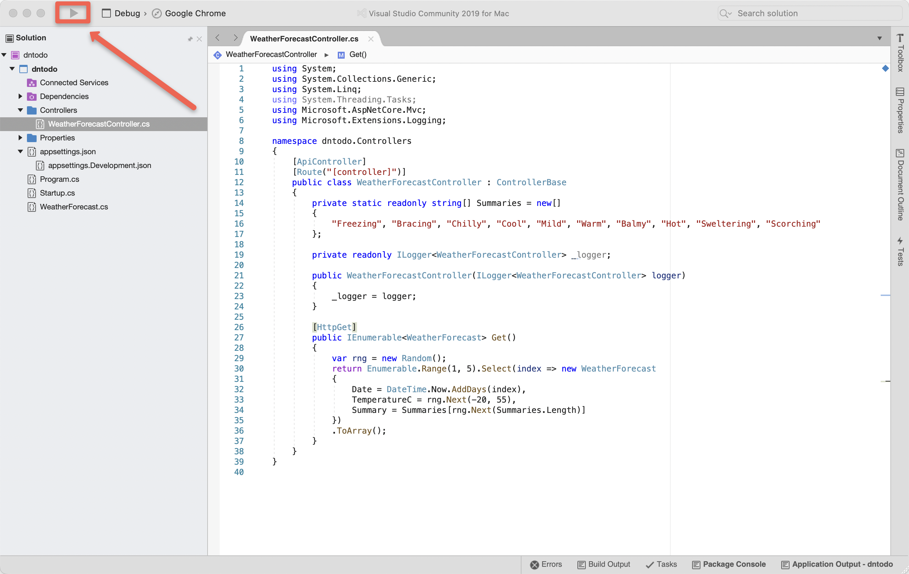

Click Run

In my case, it brings up Chrome and attempts to load `http://localhost:5000/weatherforecast` which results in 

**Access to localhost was denied** on my machine

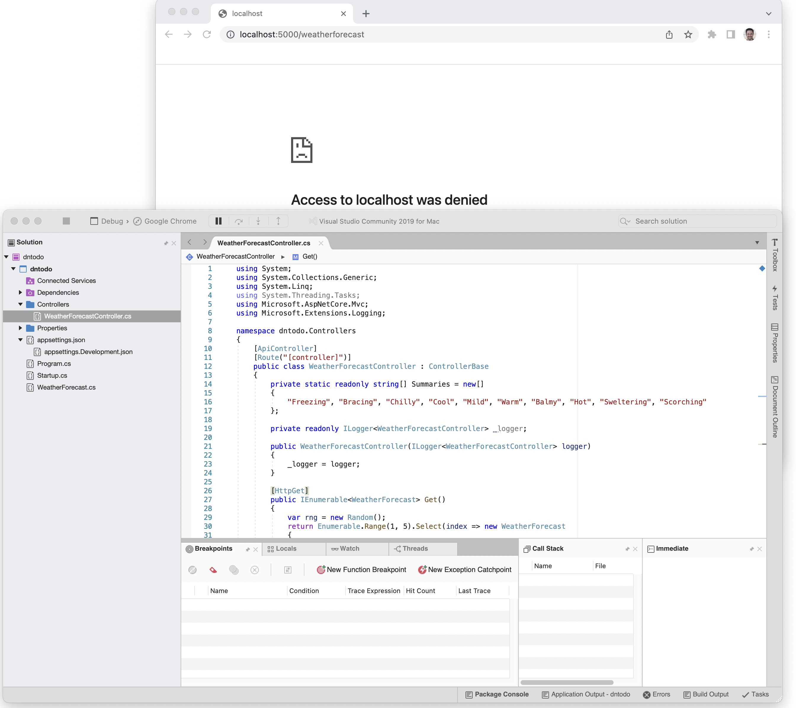

If this happens to you try an Incognito window or perhaps another brower. 

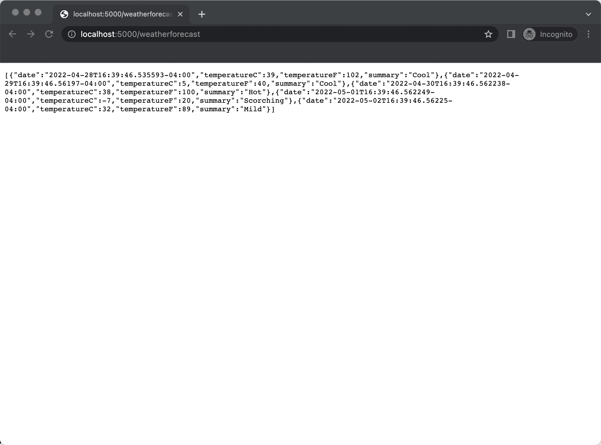

You can also use the terminal 

```
curl http://localhost:5000/weatherforecast
```

```
[{"date":"2022-04-28T16:41:49.079913-04:00","temperatureC":50,"temperatureF":121,"summary":"Balmy"},{"date":"2022-04-29T16:41:49.08126-04:00","temperatureC":-1,"temperatureF":31,"summary":"Sweltering"},{"date":"2022-04-30T16:41:49.08145-04:00","temperatureC":8,"temperatureF":46,"summary":"Freezing"},{"date":"2022-05-01T16:41:49.081452-04:00","temperatureC":-15,"temperatureF":6,"summary":"Freezing"},{"date":"2022-05-02T16:41:49.081452-04:00","temperatureC":35,"temperatureF":94,"summary":"Sweltering"}]
```

Make some changes and save, refresh your browser or re-run the curl.  The code changes were not picked up automatically.  

```
    _logger.LogInformation("Stuff is happening");
```

Hit the Stop button (basically what the Play/Run button becomes) and then hit Play/Run again to pick up the code changes

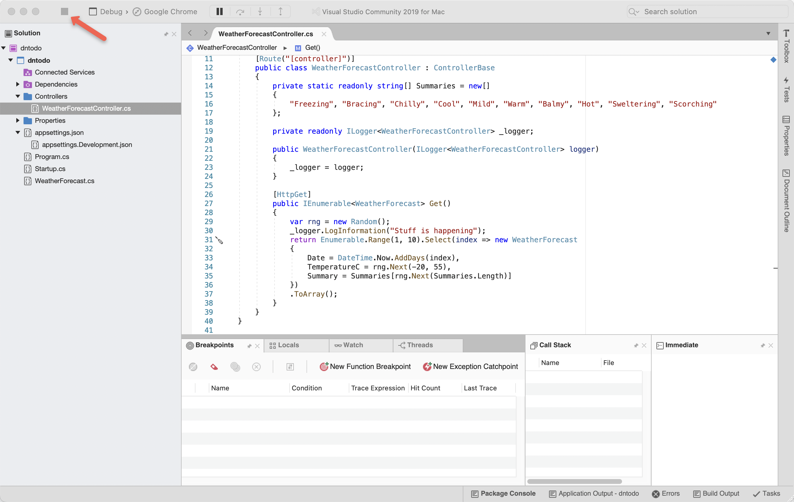

To see the loggingg, use the View menu, Other Windows, Application Output

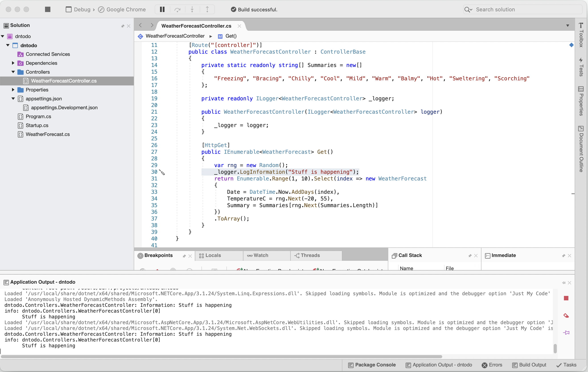

Well that is not fun, all that stopping and starting, let's get some live reload going like we have for Java and Node.js

Install the [dotnet CLI](https://docs.microsoft.com/en-us/dotnet/core/install/macos)

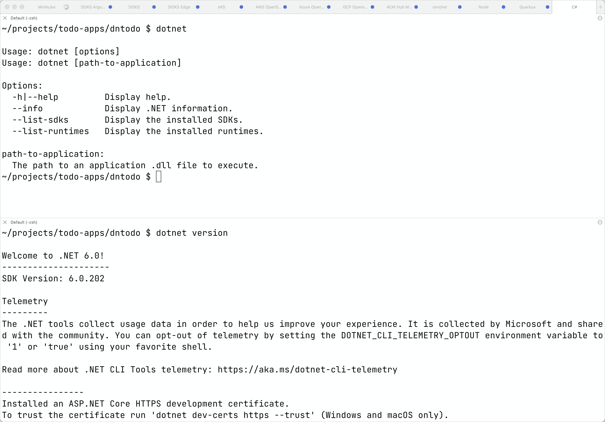

```
dotnet --list-runtimes
Microsoft.AspNetCore.App 6.0.4 [/usr/local/share/dotnet/shared/Microsoft.AspNetCore.App]
Microsoft.NETCore.App 6.0.4 [/usr/local/share/dotnet/shared/Microsoft.NETCore.App]
```

In the same directory as the **.csproj** file use `dotnet watch`

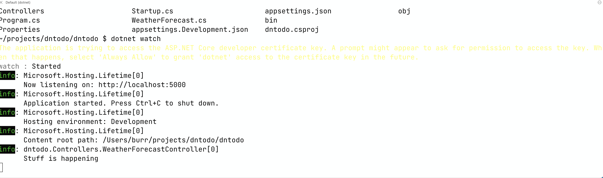

You should see the logging out put, plus the brower opens with the URL **http://localhost:5000/weatherforecast**

Make a change, Ctrl-S to save, refresh or issue a new curl command

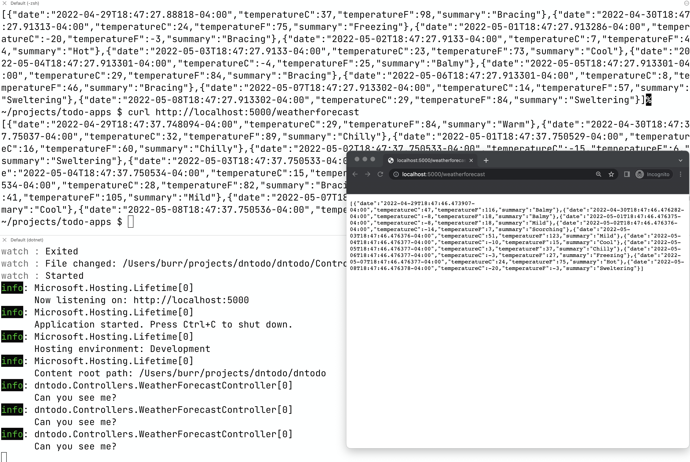

To turn off hot reload (not now but in case you need to later)

```
dotnet watch --no-hot-reload
```

Edit **launchSettings.json** to replace launchURL weatherforecast in 2 places with "api".  I also like to turn launchBrowser to false


```
{
  "$schema": "http://json.schemastore.org/launchsettings.json",
  "iisSettings": {
    "windowsAuthentication": false,
    "anonymousAuthentication": true,
    "iisExpress": {
      "applicationUrl": "http://localhost:2297",
      "sslPort": 0
    }
  },
  "profiles": {
    "IIS Express": {
      "commandName": "IISExpress",
      "launchBrowser": false,
      "launchUrl": "api/todo",
      "environmentVariables": {
        "ASPNETCORE_ENVIRONMENT": "Development"
      }
    },
    "dntodo": {
      "commandName": "Project",
      "launchBrowser": false,
      "launchUrl": "api",
      "applicationUrl": "http://localhost:5000",
      "environmentVariables": {
        "ASPNETCORE_ENVIRONMENT": "Development"
      }
    }
  }
}

```

Add a new Folder called **models**

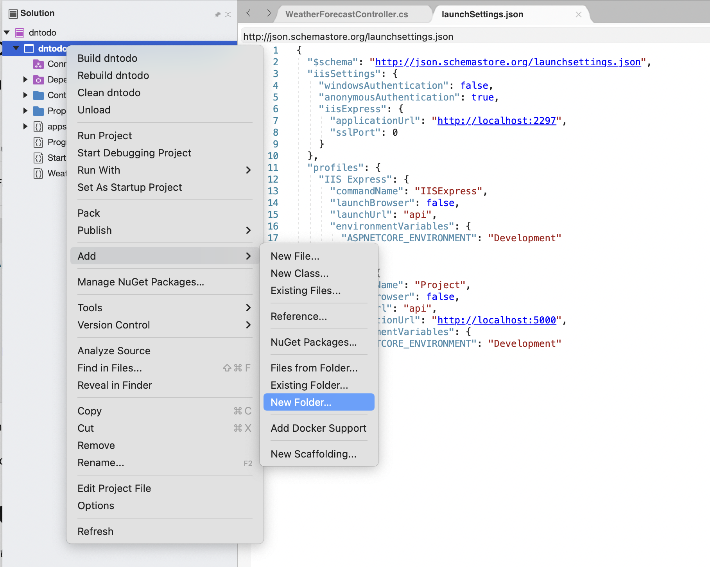

Add a new Class called **Todo**

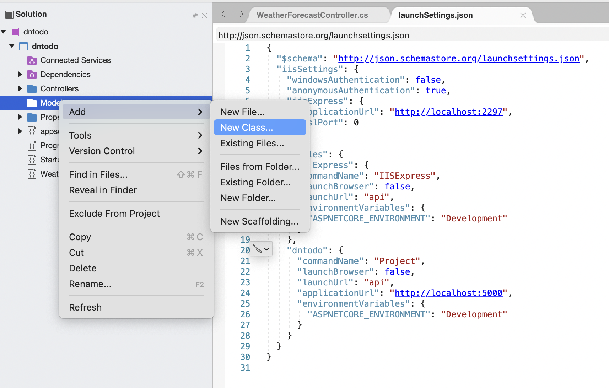

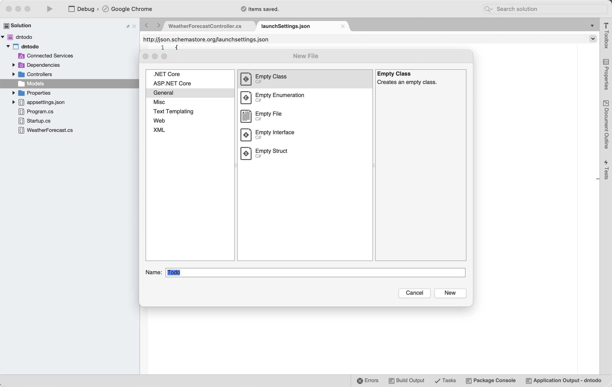

And add the following class code

```
using System;
namespace dntodo.Models
{
    public class Todo
    {
      public long Id { get; set; }
      public string? Title { get; set; }
      public bool Completed { get; set; }
    }
}
```

Add another Class called **TodoContext**

```
using Microsoft.EntityFrameworkCore;
using System.Diagnostics.CodeAnalysis;

namespace TodoApi.Models
{
    public class TodoContext : DbContext
    {
        public TodoContext(DbContextOptions<TodoContext> options)
            : base(options)
        {
        }

        public DbSet<Todo> Todos { get; set; } = null!;
    }
}
```

This will result in compilation errors


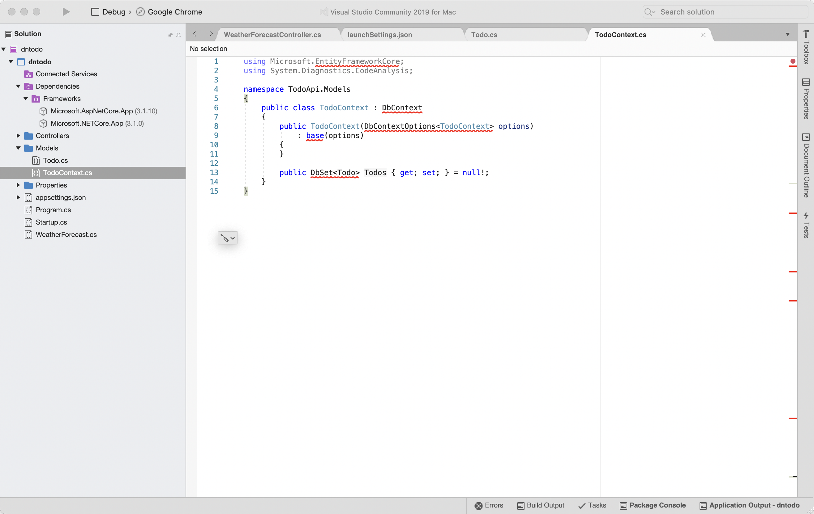

Right-click on Dependencies

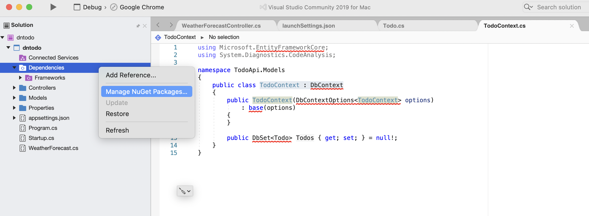


### Supporting documentation

https://docs.microsoft.com/en-us/aspnet/core/tutorials/first-web-api?view=aspnetcore-6.0&tabs=visual-studio-mac

https://docs.microsoft.com/en-us/aspnet/core/test/hot-reload?view=aspnetcore-6.0

https://docs.microsoft.com/en-us/aspnet/core/tutorials/web-api-help-pages-using-swagger?view=aspnetcore-6.0

