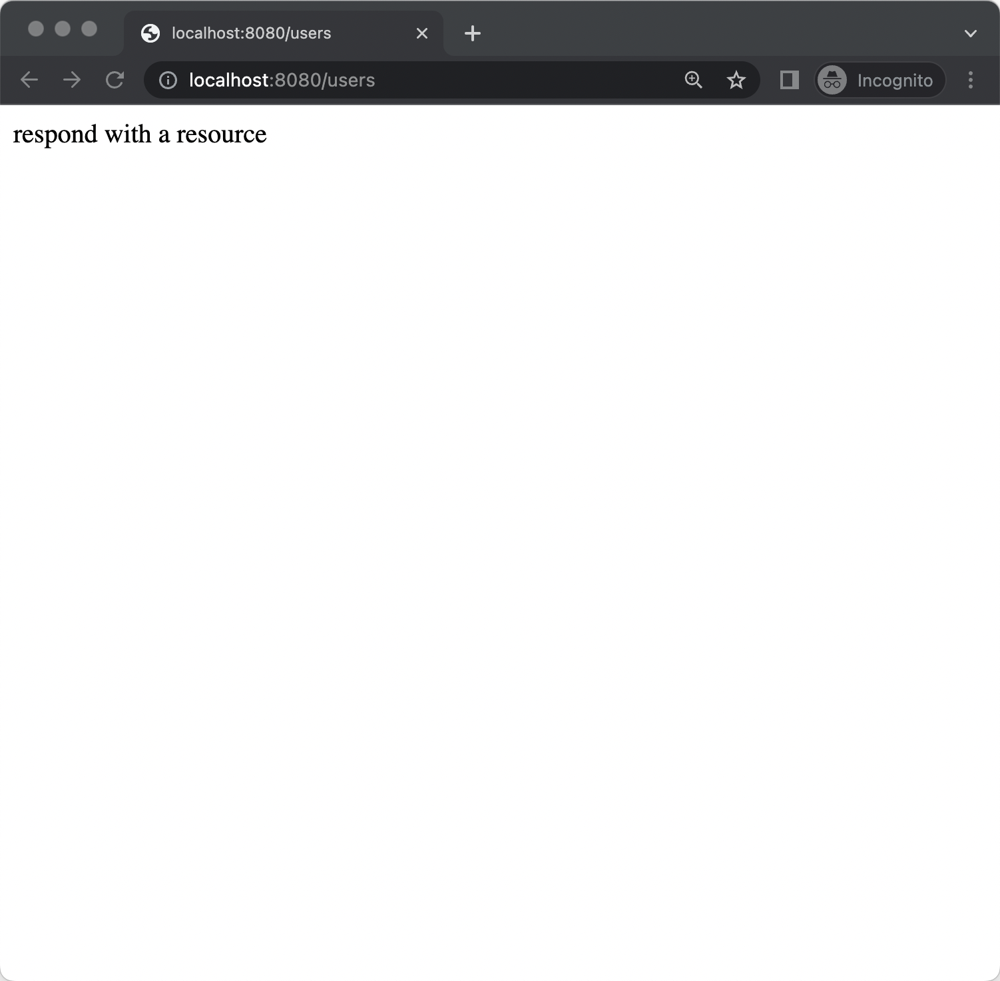
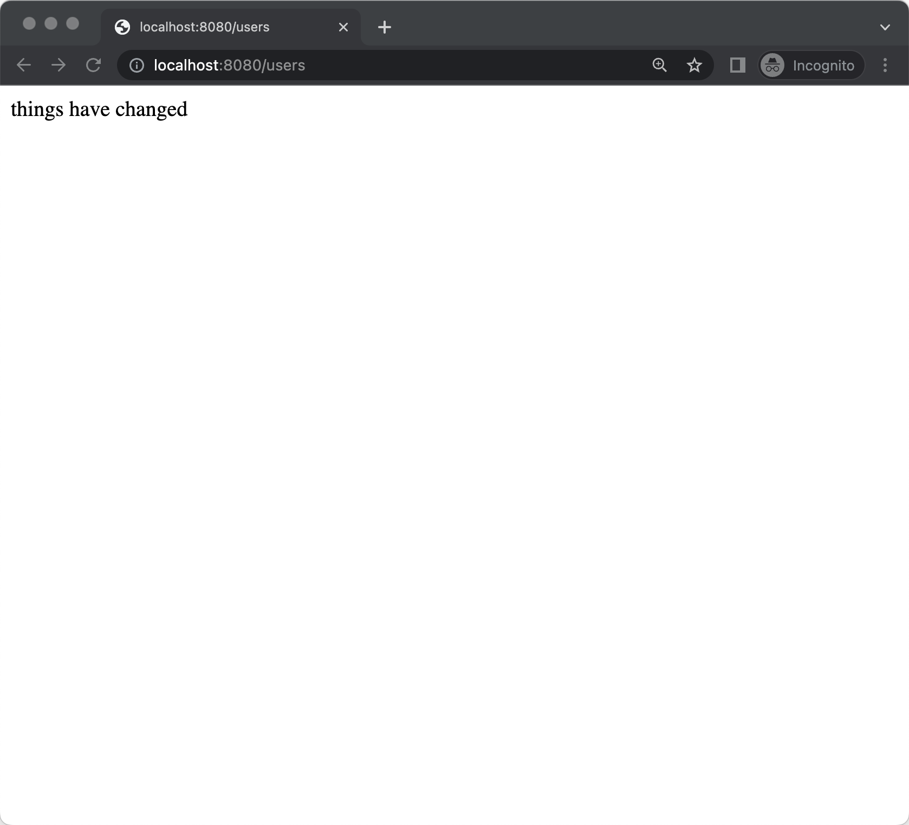

# Node.js 

[Node Version Manager - nvm](https://github.com/nvm-sh/nvm#installing-and-updating)

```
nvm --version
0.39.1

nvm install --lts

nvm use --lts

node --version
v16.14.2

npm --version
8.5.0

npx --version
8.5.0
```

```
mkdir netodo
cd netodo
```
https://expressjs.com/en/starter/generator.html

```
npx express-generator --git --no-view
```

```
Need to install the following packages:
  express-generator
Ok to proceed? (y) y
```

```
tree
.
├── app.js
├── bin
│   └── www
├── package.json
├── public
│   ├── images
│   ├── index.html
│   ├── javascripts
│   └── stylesheets
│       └── style.css
└── routes
    ├── index.js
    └── users.js
```

```
npm install
```

```
npm start
```


Ctrl-c to stop `npm start`

Modify port to allow for environment override and 8080 which is more common to use in a linux container world

Open app.js and the following lines BEFORE `module.exports = app;`

```
var port = process.env.PORT || 8080;

app.listen(port, function () {
  console.log('my app listening on port ' + port + '!');
});
```

```
npm start
```



Ctrl-c to stop `npm start`

Add in `nodemon` to provide dynamic reloading to acheive edit-save-refresh

```
npm install --save-dev nodemon 
```

Open and edit package.json 

```
{
  "name": "netodo",
  "version": "0.0.0",
  "private": true,
  "scripts": {
    "devStart": "nodemon server.js",
    "start": "node ./bin/www"
  },
  "dependencies": {
    "cookie-parser": "~1.4.4",
    "debug": "~2.6.9",
    "express": "~4.16.1",
    "morgan": "~1.9.1"
  },
  "devDependencies": {
    "nodemon": "^2.0.16"
  }
}

```

```
npm run devStart
```

```
open localhost:8080/users
```

Now open and modify `users.js`

```
var express = require('express');
var router = express.Router();

/* GET users listing. */
router.get('/', function(req, res, next) {
  res.send('things have changed');
});

module.exports = router;
```

Save and refresh the browser



Adding a postgres database connection

```
npm install pg
```

And launch a local postgres
```
docker run --name todo -e POSTGRESQL_USER=todo -e POSTGRESQL_PASSWORD=todo -e POSTGRESQL_DATABASE=todo -d -p 5432:5432 centos/postgresql-10-centos7
```

Create a directory called `db` and add a file called `index.js`.  


Create a directory called `api` and add a file called `todo.js`.  


Inside the routes directory create a new file called `todo.js`


Edit app.js

```
npm run devStart
```

```
open http://localhost:8080/api
```


