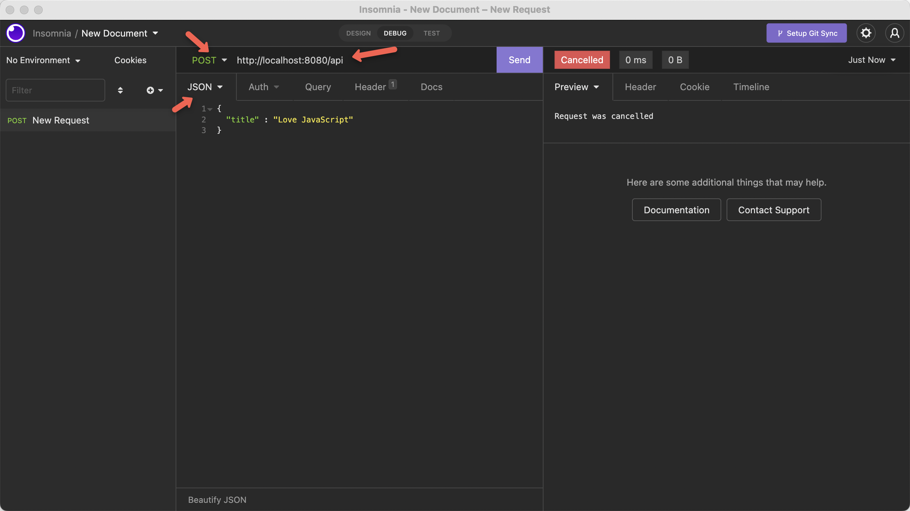

# Node.js 

[Node Version Manager - nvm](https://github.com/nvm-sh/nvm#installing-and-updating)

```
nvm --version
0.39.1

nvm install --lts

nvm use --lts

node --version
v16.14.2

npm --version
8.5.0

npx --version
8.5.0
```

A nice video the describes REST+CRUD+Postgres

https://www.youtube.com/watch?v=_Mun4eOOf2Q


### Create Schema

Install Postgres
https://postgresapp.com/

Install pgAdmin
https://www.pgadmin.org/


Using your terminal, connect to your database engine

```
psql -U postgres

\l

```

Create role

```
\du

CREATE ROLE todo WITH LOGIN PASSWORD 'todo';

\du
```

Create database

```
CREATE DATABASE todo with OWNER todo;

\c todo todo

```

Create table

```
CREATE TABLE IF NOT EXISTS todo (
    id        SERIAL PRIMARY KEY,
    title     VARCHAR(255),
    completed boolean,
    ordering  integer,
    url       VARCHAR(255)
);

\dt
```

### Create Code


```
mkdir express-todo
npm init -y
touch index.js
```

```
npm install express
npm install pg

npm install -g nodemon
```

Modify package.json

```
{
  "name": "express-todo",
  "version": "1.0.0",
  "description": "",
  "main": "index.js",
  "scripts": {
    "start": "node ./index.js",
    "dev" : "nodemon ./index.js"
  },
  "keywords": [],
  "author": "",
  "license": "ISC",
  "dependencies": {
    "express": "^4.18.1",
    "pg": "^8.7.3"
  }
}
```

Edit index.js

```
const express = require('express');
const app = express();

var port = process.env.PORT || 8080;

app.listen(port, function () {
  console.log('my app listening on port ' + port + '!');
});
```

Start dev runtime

```
npm run dev
```

Test with a curl

```
curl localhost:8080
```

Results

```
<!DOCTYPE html>
<html lang="en">
<head>
<meta charset="utf-8">
<title>Error</title>
</head>
<body>
<pre>Cannot GET /</pre>
</body>
</html>
```

https://insomnia.rest/download


Add db.js, holds the database connection

```
const Pool = require("pg").Pool;

const pool = new Pool({
  user: "todo",
  password: "todo",
  database: "todo",
  host: "localhost",
  port: 5432
})

module.exports = pool;
```

Edit index.js to require `db` and use express.json, giving us access to request.body

```
const express = require('express');
const app = express();
const pool = require("./db");

app.use(express.json());


// get all todos

// get a todo

// create a todo

// update a todo

// delete a todo


var port = process.env.PORT || 8080;

app.listen(port, function () {
  console.log('my app listening on port ' + port + '!');
});

```

### POST/Create

Edit index.js for POST/create

```
app.post("/api", async(req, res) => {
    try {
      console.log(req.body);
    } catch (err) {
      console.error(err.message);
    }
})
```

Test via a REST Client




Edit index.js to persist todo to database

```
// create a todo
app.post("/api", async(req, res) => {
    try {      
      const { title } = req.body;
      const { completed } = req.body;
      console.log(title + ' ' + completed);
      const newTodo = 
      await pool.query("INSERT INTO todo (title, completed) VALUES ($1, $2) RETURNING *",
       [title, completed]);
      res.json(newTodo); 
    } catch (err) {
      console.error(err.message);
    }
})
```

Test with REST Client


```
{
	"title" : "Love JavaScript",
	"completed" : false
}
```


And verify with psql

```
select * from todo;
```


### GET/Read

Edit index.js

```
// get all todos
app.get("/api", async(req, res) => {
    try {
      const allTodos = await pool.query("SELECT * FROM todo");
      res.json(allTodos.rows);
    } catch (err) {
        console.error(err.message);
    }
})
```


Add a few more records via POST

```
curl -d '{"title":"Love Express", "completed":false}' -H "Content-Type: application/json" -X POST http://localhost:8080/api

curl -d '{"title":"Love Postgres", "completed":false}' -H "Content-Type: application/json" -X POST http://localhost:8080/api

curl -d '{"title":"Be Awesome", "completed":false}' -H "Content-Type: application/json" -X POST http://localhost:8080/api
```


```
select * from todo;
 id |      title      | completed | ordering | url
----+-----------------+-----------+----------+-----
  1 | Love JavaScript | f         |          |
  2 | Love Express    | f         |          |
  3 | Love Postgres   | f         |          |
  4 | Be Awesome      | f         |          |
(4 rows)
```

### GET/Read a Todo

```
// get a todo
app.get("/api/:id", async(req, res) => {    
    try {
        const { id } = req.params;
        const todo = await pool.query("SELECT * FROM todo WHERE id = $1", [id]);
        res.json(todo.rows[0]);
      } catch (err) {
          console.error(err.message);
      }  
})
```

And test with a curl 

```
curl localhost:8080/api/1
```

```
{"id":1,"title":"Love JavaScript","completed":false,"ordering":null,"url":null}
```

### PATCH/Update a Todo 

Edit index.js 

```
// update a todo
app.patch("/api/:id", async(req, res) => {    
    try {
        const { id } = req.params;
        const { title } = req.body;
        const { completed } = req.body;
        const todo = await pool.query("UPDATE todo SET title = $1, completed = $2 WHERE id = $3", 
         [title, completed, id]);
        res.json("Updated");        
      } catch (err) {
          console.error(err.message);
      }  
})
```


```
curl localhost:8080/api/2
{"id":2,"title":"Be Awesome Again","completed":true,"ordering":null,"url":null}
```

### DELETE a Todo 

```
// delete a todo
app.delete("/api/:id", async(req, res) => {    
    try {
        const { id } = req.params;
        const todo = await pool.query("DELETE FROM todo WHERE id = $1", [id]);
        res.json("Deleted");
      } catch (err) {
          console.error(err.message);
      }  
})
```


Verify via psql

```
select * from todo;
 id |      title      | completed | ordering | url
----+-----------------+-----------+----------+-----
  1 | Love JavaScript | f         |          |
  3 | Love Postgres   | f         |          |
  4 | Be Awesome      | f         |          |
(3 rows)
```

Verify via curl
```
curl localhost:8080/api
[{"id":1,"title":"Love JavaScript","completed":false,"ordering":null,"url":null},{"id":3,"title":"Love Postgres","completed":false,"ordering":null,"url":null},{"id":4,"title":"Be Awesome","completed":false,"ordering":null,"url":null}]
```

### Add TodoMVC GUI

Create a directory called "public" and add the files from...

Edit index.js

```
const path = require('path');

// static page serving
app.use(express.static(path.join(__dirname, 'public')));
app.get("/", async(req,res,next) => {
  res.render('index');
})
```

Browser to load the UI


Make changes

Note: not everything is operational but the basics work


And check via psql

```
select * from todo;
 id |      title      | completed | ordering | url
----+-----------------+-----------+----------+-----
  4 | Be More Awesome | f         |          |
  1 | Love JavaScript | t         |          |
(2 rows)
```


### Ready for Kubernetes/OpenShift

Move configuration into environment variables

```
npm install dotenv
```

Create a file named `.env`

With the following contents:

```
DB_NAME=todo
DB_HOST=localhost
DB_PORT=5432
DB_USER=todo
DB_PASS=todo
```

Modify db.js

```
const pool = new Pool({
  user: process.env.DB_USER || "todo",
  password: process.env.DB_PASS || "todo",
  database: process.env.DB_NAME || "todo",
  host: process.env.DB_HOST || "localhost",
  port: process.env.DB_PORT || 5432
})
```

Modify index.js

And insert the following line BEFORE `const pool = require("./db")`

```
require('dotenv').config()
```

### OpenShift Import from git

For an easy way to get an OpenShift, go to https://developers.redhat.com/developer-sandbox/get-started

[OpenShift Sandbox](https://developers.redhat.com/developer-sandbox/get-started)

Account creation and login skipped for the purposes of this tutorial


#### First add the Postgres database


```
psql -U todo

\c todo
```


```
CREATE TABLE IF NOT EXISTS todo (
    id        SERIAL PRIMARY KEY,
    title     VARCHAR(255),
    completed boolean,
    ordering  integer,
    url       VARCHAR(255)
);
```

```
\dt
```


#### Import code from git

+Add


```
https://github.com/burrsutter/todo-apps
```

Show Advanced Git options


Add the Env vars originally set in the .env file or db.js

```
DB_USER
DB_PASS
DB_NAME
DB_HOST
DB_PORT
```


Watch the redeployment


Find for URL


Add some todo items


Back to the Postgresql Terminal 


```
psql -U todo
\c todo
select * from todo;
```


