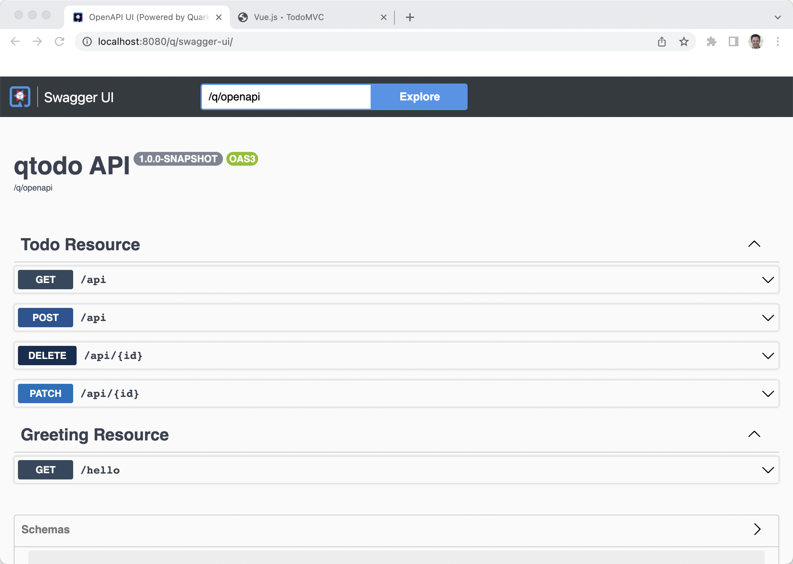

## Quarkus


https://code.quarkus.io/

RESTEasy Reactive
RESTEasy Reactive Jackson
Hibernate ORM with Panache
SmallRye OpenAPI
SmallRye Health
Micrometer Metrics
Micrometer Registry Prometheus
JDBC Driver - PostgresSQL


```
mkdir ~/projects/todo-projects

cd ~/projects/todo-projects

mv ~/Downloads/qtodo.zip .

unzip qtodo.zip

cd qtodo

tree qtodo

.
├── README.md
├── mvnw
├── mvnw.cmd
├── pom.xml
└── src
    ├── main
    │   ├── docker
    │   │   ├── Dockerfile.jvm
    │   │   ├── Dockerfile.legacy-jar
    │   │   ├── Dockerfile.native
    │   │   └── Dockerfile.native-micro
    │   ├── java
    │   │   └── com
    │   │       └── burrsutter
    │   │           ├── GreetingResource.java
    │   │           └── MyLivenessCheck.java
    │   └── resources
    │       ├── META-INF
    │       │   └── resources
    │       │       └── index.html
    │       └── application.properties
    └── test
        └── java
            └── com
                └── burrsutter
                    ├── GreetingResourceIT.java
                    └── GreetingResourceTest.java

```

```
code .
```


```
mvn quarkus:dev
```


```
curl localhost:8080/hello
Hello from RESTEasy Reactive
```


Back to VS Code


New File

```
Todo.java
```


```
@Entity

extends PanacheEntity
```

Shift-Option-O (Organize Imports)


New File

```
TodoResource.java
```

```
@Path("/api")
@Produces("application/json")
@Consumes("application/json")
```

Shift-Option-O (Organize Imports)

```
    @GET
    public List<Todo> getAll() {
        return Todo.listAll();
    }
```

Shift-Option-O (Organize Imports)

Ctrl-S  (Save)

```
curl http://localhost:8080/api
[]
```

```
    @POST
    @Transactional
    public Response create(Todo item) {
        item.id = null;
        item.persist();
        return Response.status(Status.CREATED).entity(item).build();
    }
```

Shift-Option-O (Organize Imports)

Ctrl-S  (Save)


```
curl -X 'POST' \
  'localhost:8080/api' \
  -H 'accept: */*' \
  -H 'Content-Type: application/json' \
  -d '{
  "id": 0,
  "title": "Do a thing",
  "completed": false
}'
```

```
curl http://localhost:8080/api
[{"id":1,"title":"Do a thing","completed":false,"order":0,"url":null}]
```

Drag & Drop frontend js, node_modules, package.json, package-lock.json, package.json, todo.html

to src/resources/META-INF/resources


Browser: http://localhost:8080/todo.html

Enter "Do another thing"


```
    @PATCH
    @Path("/{id}")
    @Transactional
    public Response update(Todo todo, @PathParam("id") Long id) {
        Todo entity = Todo.findById(id);
        entity.id = id;
        entity.completed = todo.completed;
        entity.order = todo.order;
        entity.title = todo.title;
        entity.url = todo.url;
        return Response.ok(entity).build();
```    

Refresh Browser: http://localhost:8080/todo.html

Add Fred, Sally, John and UPDATED! on Sally


```
    @DELETE
    @Transactional
    @Path("/{id}")
    public Response deleteOne(@PathParam("id") Long id) {
        Todo entity = Todo.findById(id);
        if (entity == null) {
            throw new WebApplicationException("Todo with id of " + id + " does not exist.", Status.NOT_FOUND);
        }
        entity.delete();
        return Response.noContent().build();
    }
```

Ctrl-S

Refresh Browser: http://localhost:8080/todo.html

Add Apple, Banana, Grapefruit


And then hit the red X beside Banana

Refresh Browser: http://localhost:8080/todo.html


Browser: http://localhost:8080/q/swagger-ui/




Up to this moment, "mvn quarkus:dev" has been using its Dev Services capbility to dynamically provide a Postgres Database.  

http://localhost:8080/q/dev/io.quarkus.quarkus-vertx-http/dev-services


This magic was faciltated by the inclusion of the Postgress JDBC Driver, TestContainers and Docker Desktop.

```
docker ps
```


To get ready for testing within Kubernetes/OpenShift, we need to provide the declarative properties and connection parameters.


Edit application.properties

Type "q.h.d.g" and hit return


Type "update" and hit return

Type "q.d.j.u" and hit return

Type "jdbc:postgresql://postgresql/todo" and hit return

Type "q.d.us" and hit return

Type "todo" and hit return

Type "q.d.p" and hit return

Type "todo" and hit return

Type "q.p.ty" and hit return

Type "uber-jar" and hit return

Cntrl-S


Add a prefix of `%prod` so that things work more cleanly between your localhost dev mode and your test/production cluster.


Make sure to "Ctrl-C" the `mvn quarkus:dev` and shut it down

```
mvn package
```


```
ls -la target
total 72064
drwxr-xr-x  13 burr  staff       416 Apr 23 15:29 .
drwxr-xr-x@ 12 burr  staff       384 Apr 23 13:33 ..
drwxr-xr-x   5 burr  staff       160 Apr 23 13:37 classes
drwxr-xr-x   3 burr  staff        96 Apr 23 13:33 generated-sources
drwxr-xr-x   3 burr  staff        96 Apr 23 13:33 generated-test-sources
drwxr-xr-x   3 burr  staff        96 Apr 23 15:23 maven-archiver
drwxr-xr-x   3 burr  staff        96 Apr 23 13:33 maven-status
-rw-r--r--   1 burr  staff  35653430 Apr 23 15:29 qtodo-1.0.0-SNAPSHOT-runner.jar
-rw-r--r--   1 burr  staff   1232955 Apr 23 15:29 qtodo-1.0.0-SNAPSHOT.jar.original
drwxr-xr-x   3 burr  staff        96 Apr 23 13:37 quarkus
-rw-r--r--   1 burr  staff       121 Apr 23 15:29 quarkus-artifact.properties
drwxr-xr-x   4 burr  staff       128 Apr 23 15:22 surefire-reports
drwxr-xr-x   4 burr  staff       128 Apr 23 15:29 test-classes
```

The `qtodo-1.0.0-SNAPSHOT-runner.jar` is the one you want for Drag & Drop

You can run a quick test of it by simply using


### Deploy via OpenShift Drag & Drop

For an easy way to get an OpenShift, go to https://developers.redhat.com/developer-sandbox/get-started

[OpenShift Sandbox](https://developers.redhat.com/developer-sandbox/get-started)

Account creation and login skipped for the purposes of this tutorial


Hit the Create button


You should get a red ring because the app needs a database

Add 


Answer some questions

PostgreSQL Connection Username: todo
PostgreSQL Connection Password: todo
PostgreSQL Database Name: todo

and click Create


Looking for blue rings


Find the URL,


Add some Todos 


Now, let's go see if our data really landed in the database, back in the OpenShift Console, Click on DC postgresql


Click on pod identifier/name


Click on Terminal and type `psql`


See the databases

```
\l
```

See the users

```
\du
```


Connect to the todo database

```
\c todo
```

See the tables

```
\dt
```


See the todos

```
select * from todos;
```

Note: That trailing semi-colon is VERY important


### Deploy via Kubernetes yamls


### Deploy via OpenShift S2I

Create a git repo and `git commit` and `git push` the contents of qtodo in

