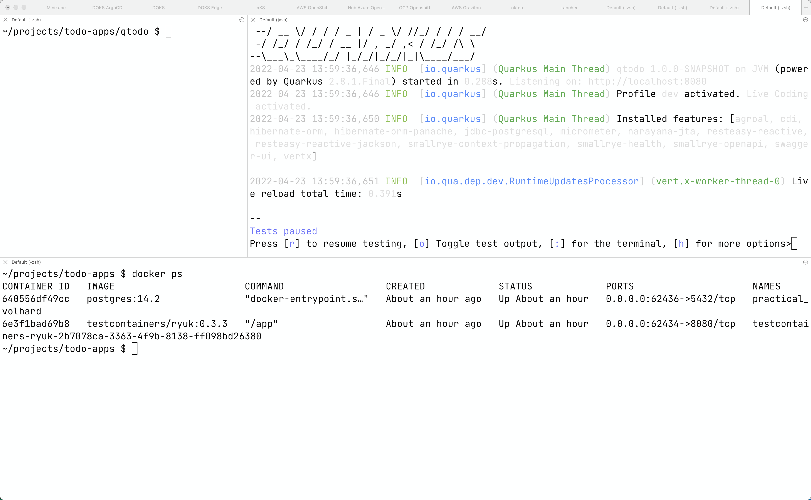

# Quarkus


## Java Setup
https://sdkman.io/

```
sdk install java 17.0.2-open
sdk use java 17.0.2-open
```


```
java -version 
openjdk version "17.0.2" 2022-01-18
```

```
sdk install maven 3.8.5
sdk use maven 3.8.5
```

```
mvn -v
Apache Maven 3.8.5 (3599d3414f046de2324203b78ddcf9b5e4388aa0)
```

https://code.visualstudio.com/

Community Edition of IntelliJ IDEA

https://www.jetbrains.com/idea/download/#section=mac


## New Quarkus Project

https://code.quarkus.io/

RESTEasy Reactive

RESTEasy Reactive Jackson

Hibernate ORM with Panache

SmallRye OpenAPI

SmallRye Health

Micrometer Metrics

Micrometer Registry Prometheus

JDBC Driver - PostgresSQL


```
mkdir ~/projects/todo-projects

cd ~/projects/todo-projects

mv ~/Downloads/qtodo.zip .

unzip qtodo.zip

cd qtodo

tree qtodo

.
├── README.md
├── mvnw
├── mvnw.cmd
├── pom.xml
└── src
    ├── main
    │   ├── docker
    │   │   ├── Dockerfile.jvm
    │   │   ├── Dockerfile.legacy-jar
    │   │   ├── Dockerfile.native
    │   │   └── Dockerfile.native-micro
    │   ├── java
    │   │   └── com
    │   │       └── burrsutter
    │   │           ├── GreetingResource.java
    │   │           └── MyLivenessCheck.java
    │   └── resources
    │       ├── META-INF
    │       │   └── resources
    │       │       └── index.html
    │       └── application.properties
    └── test
        └── java
            └── com
                └── burrsutter
                    ├── GreetingResourceIT.java
                    └── GreetingResourceTest.java

```

```
code .
```


```
mvn quarkus:dev
```


```
curl localhost:8080/hello
Hello from RESTEasy Reactive
```


Back to VS Code


New File

```
Todo.java
```


```
@Entity

extends PanacheEntity
```

Shift-Option-O (Organize Imports)


```
    @Column(unique = true)
    public String title;

    public boolean completed;

    @Column(name = "ordering")
    public int order;

    public String url;
```

Shift-Option-O (Organize Imports)


New File

```
TodoResource.java
```

```
@Path("/api")
@Produces("application/json")
@Consumes("application/json")
```

Shift-Option-O (Organize Imports)

```
    @GET
    public List<Todo> getAll() {
        return Todo.listAll();
    }
```

Shift-Option-O (Organize Imports)

Ctrl-S  (Save)

```
curl http://localhost:8080/api
[]
```

```
    @POST
    @Transactional
    public Response create(Todo item) {
        item.id = null;
        item.persist();
        return Response.status(Status.CREATED).entity(item).build();
    }
```

Shift-Option-O (Organize Imports)

Ctrl-S  (Save)


```
curl -X 'POST' \
  'localhost:8080/api' \
  -H 'accept: */*' \
  -H 'Content-Type: application/json' \
  -d '{
  "id": 0,
  "title": "Do a thing",
  "completed": false
}'
```

```
curl http://localhost:8080/api
[{"id":1,"title":"Do a thing","completed":false,"order":0,"url":null}]
```

Drag & Drop frontend js, node_modules, package.json, package-lock.json, package.json, todo.html

to src/resources/META-INF/resources


Browser: http://localhost:8080/todo.html

Enter "Do another thing"


```
    @PATCH
    @Path("/{id}")
    @Transactional
    public Response update(Todo todo, @PathParam("id") Long id) {
        Todo entity = Todo.findById(id);
        entity.id = id;
        entity.completed = todo.completed;
        entity.order = todo.order;
        entity.title = todo.title;
        entity.url = todo.url;
        return Response.ok(entity).build();
```    

Refresh Browser: http://localhost:8080/todo.html

Add Fred, Sally, John and UPDATED! on Sally


```
    @DELETE
    @Transactional
    @Path("/{id}")
    public Response deleteOne(@PathParam("id") Long id) {
        Todo entity = Todo.findById(id);
        if (entity == null) {
            throw new WebApplicationException("Todo with id of " + id + " does not exist.", Status.NOT_FOUND);
        }
        entity.delete();
        return Response.noContent().build();
    }
```

Ctrl-S

Refresh Browser: http://localhost:8080/todo.html

Add Apple, Banana, Grapefruit


And then hit the red X beside Banana

Refresh Browser: http://localhost:8080/todo.html


Browser: http://localhost:8080/q/swagger-ui/


Up to this moment, "mvn quarkus:dev" has been using its Dev Services capability to dynamically provide a Postgres Database.  

http://localhost:8080/q/dev/io.quarkus.quarkus-vertx-http/dev-services


This magic was faciltated by the inclusion of the Postgress JDBC Driver, TestContainers and Docker Desktop.

```
docker ps
```



To get ready for testing within Kubernetes/OpenShift, we need to provide the declarative properties and connection parameters.


Edit application.properties

Type "q.h.d.g" and hit return


Type "update" and hit return

Type "q.d.j.u" and hit return

Type "jdbc:postgresql://postgresql/todo" and hit return

Type "q.d.us" and hit return

Type "todo" and hit return

Type "q.d.p" and hit return

Type "todo" and hit return

Type "q.p.ty" and hit return

Type "uber-jar" and hit return

Cntrl-S


Add a prefix of `%prod` so that things work more cleanly between your localhost dev mode and your test/production cluster.


Here is the full listing if you just wish to copy & paste

```
%prod.quarkus.hibernate-orm.database.generation=update
%prod.quarkus.datasource.jdbc.url=jdbc:postgresql://postgresql/todo
%prod.quarkus.datasource.username=todo
%prod.quarkus.datasource.password=todo
quarkus.package.type=uber-jar
```


Make sure to "Ctrl-C" the `mvn quarkus:dev` and shut it down

```
mvn package
```


```
ls -la target
total 72064
drwxr-xr-x  13 burr  staff       416 Apr 23 15:29 .
drwxr-xr-x@ 12 burr  staff       384 Apr 23 13:33 ..
drwxr-xr-x   5 burr  staff       160 Apr 23 13:37 classes
drwxr-xr-x   3 burr  staff        96 Apr 23 13:33 generated-sources
drwxr-xr-x   3 burr  staff        96 Apr 23 13:33 generated-test-sources
drwxr-xr-x   3 burr  staff        96 Apr 23 15:23 maven-archiver
drwxr-xr-x   3 burr  staff        96 Apr 23 13:33 maven-status
-rw-r--r--   1 burr  staff  35653430 Apr 23 15:29 qtodo-1.0.0-SNAPSHOT-runner.jar
-rw-r--r--   1 burr  staff   1232955 Apr 23 15:29 qtodo-1.0.0-SNAPSHOT.jar.original
drwxr-xr-x   3 burr  staff        96 Apr 23 13:37 quarkus
-rw-r--r--   1 burr  staff       121 Apr 23 15:29 quarkus-artifact.properties
drwxr-xr-x   4 burr  staff       128 Apr 23 15:22 surefire-reports
drwxr-xr-x   4 burr  staff       128 Apr 23 15:29 test-classes
```

The `qtodo-1.0.0-SNAPSHOT-runner.jar` is the one you want for Drag & Drop


### Deploy via OpenShift Drag & Drop

[Video recording of the Drag & Drop](https://youtu.be/nNWDCLg8ZhI)


For an easy way to get an OpenShift, go to https://developers.redhat.com/developer-sandbox/get-started

[OpenShift Sandbox](https://developers.redhat.com/developer-sandbox/get-started)

Account creation and login skipped for the purposes of this tutorial


Hit the Create button


You should get a red ring because the app needs a database

Add 


Answer some questions

- PostgreSQL Connection Username: todo

- PostgreSQL Connection Password: todo

- PostgreSQL Database Name: todo

and click **Create**


Looking for blue rings


Find the URL,


Add some Todos 


Now, let's go see if our data really landed in the database, back in the OpenShift Console, Click on DC postgresql


Click on pod identifier/name


Click on Terminal and type `psql`


See the databases

```
\l
```

See the users

```
\du
```


Connect to the todo database

```
\c todo
```

See the tables

```
\dt
```


See the todos

```
select * from todos;
```

Note: That trailing semi-colon is VERY important


Describe the schema

```
\d todo
```

```
                         Table "public.todo"
  Column   |          Type          | Collation | Nullable | Default
-----------+------------------------+-----------+----------+---------
 id        | bigint                 |           | not null |
 completed | boolean                |           | not null |
 ordering  | integer                |           |          |
 title     | character varying(255) |           |          |
 url       | character varying(255) |           |          |
```

### Deploy via OpenShift S2I

[Video recording of Import from Git](https://youtu.be/dRjr5C27LVU)

Assuming you followed the above instructions, just delete the current qtodo application


Create a git repo and `git commit` and `git push` the contents of qtodo (or just use the one I am providing)

Click +Add


Import from Git


Git Repo URL

https://github.com/burrsutter/todo-apps

And because I am using a sub-directory inside of a git repository, I need to click

*Show advanced Git options*

and type in `qtodo` there


Scroll-down, defaults should be fine


Click Create

The application will build and run, giving you a URL and you should see the Todos from your Drag & Drop deployment and testing still happily running in that same Postgres database as before.


And you can create a webhook if you want future `git push` events to trigger a build and rollout of the application into your dev cluster

[Webhooks on OpenShift](https://redhat-scholars.github.io/openshift-starter-guides/rhs-openshift-starter-guides/4.9/nationalparks-java-codechanges-github.html#prerequisite_github_account)


### Deploy via Kubernetes yamls

This is the "manual" way of interacting with a Kubernetes cluster, where you need to manually build the docker/linux container image as well as manually apply the Kubernetes yaml. If you are very new to Kubernetes then I would encourage you to first stop and spend a few days with one of the various tutorials that can be found online.  Here is one that a bunch of Red Hat folks maintain.

[Kubernetes Tutorial](https://redhat-scholars.github.io/kubernetes-tutorial/kubernetes-tutorial/index.html)

This also assumes you have spent a few days with Linux containers, Docker 

[Containers Tutorial](https://redhat-scholars.github.io/containers-tutorial/template-tutorial/index.html)

Back in your IDE (VS Code for Quarkus apps for me)

Use `shift-command-p` on your keyboard


Hit Return


Type "Kube"


Click it


Hit Return

The new dependency gets added to your pom.xml


Open up target to see what is in there


And for this part of the adventure, remove `quarkus.package.type=uber-jar` from application.properties

Your resulting application.properties will look like the following

```
%prod.quarkus.hibernate-orm.database.generation=update
%prod.quarkus.datasource.jdbc.url=jdbc:postgresql://postgresql/todo
%prod.quarkus.datasource.username=todo
%prod.quarkus.datasource.password=todo
```

At the terminal, type `mvn package`

and if it fails like the following:

```
[ERROR] Failed to execute goal io.quarkus.platform:quarkus-maven-plugin:2.8.1.Final:build (default) on project qtodo: Failed to build quarkus application: io.quarkus.builder.BuildException: Build failure: Build failed due to errors
[ERROR] 	[error]: Build step io.quarkus.kubernetes.client.deployment.KubernetesClientBuildStep#process threw an exception: io.fabric8.kubernetes.client.KubernetesClientException: JcaPEMKeyConverter is provided by BouncyCastle, an optional dependency. To use support for EC Keys you must explicitly add this dependency to classpath.
[ERROR] 	at io.fabric8.kubernetes.client.internal.CertUtils.handleECKey(CertUtils.java:164)
[ERROR] 	at io.fabric8.kubernetes.client.internal.CertUtils.loadKey(CertUtils.java:134)
[ERROR] 	at io.fabric8.kubernetes.client.internal.CertUtils.createKeyStore(CertUtils.java:112)
[ERROR] 	at io.fabric8.kubernetes.client.internal.CertUtils.createKeyStore(CertUtils.java:247)
[ERROR] 	at io.fabric8.kubernetes.client.internal.SSLUtils.keyManagers(SSLUtils.java:153)
```

Make sure all of these dependencies are in your pom.xml

```
    <dependency>
      <groupId>io.quarkus</groupId>
      <artifactId>quarkus-kubernetes</artifactId>
    </dependency>
    <dependency>
      <groupId>org.bouncycastle</groupId>
      <artifactId>bcprov-jdk15on</artifactId>
      <version>1.70</version>
    </dependency>
    <dependency>
      <groupId>org.bouncycastle</groupId>
      <artifactId>bcpkix-jdk15on</artifactId>
      <version>1.70</version>
    </dependency>
```

If failed, add the dependencies and try again

At the terminal, type `mvn package`

If all goes well, you now have a kubernetes.yaml file which can be applied to minikube, OpenShift, GKE, etc.  

Note: This does NOT include postgres, getting that service up and running on your Kubernetes cluster will need to be researched and executed manually


For the purposes of this tutorial, I will reuse the Sandbox account that is ready, with a Postgres already up and running based on the previous steps.


If needed delete any Drag & Drop or Import from Git qtodo application


You will need to login to your Kubernetes cluster, the OpenShift login process is as follows


You can download `oc` from here 

https://mirror.openshift.com/pub/openshift-v4/clients/ocp/

Once you have `oc` in your PATH, you can paste the "oc login" line into your terminal and hit enter/return.

Note: This will update ~/.kube/config or the file specified by your KUBECONFIG environment variable 

Make sure you are targeting the correct project/namespace.  "oc" has a short-hand to change namespaces on OpenShift clusters.

For non-OpenShift clusters, ask your provider to give you the needed KUBECONFIG file to download and place locally, pointed to by your KUBECONFIG environment variable.


```
oc project burrsitis-dev
Now using project "burrsitis-dev" on server "https://api.sandbox.x8i5.p1.openshiftapps.com:6443".
```

The kubectl variant is

```
kubectl config set-context --current --namespace=burrsitis-dev
```

This tutorial assumes you know how to get Postgres running, it needs to be up and happy already

```
kubectl get pods --show-labels
```

```
kubectl get pods --show-labels
NAME                 READY   STATUS    RESTARTS   AGE   LABELS
postgresql-1-xxzk7   1/1     Running   0          48m   deployment=postgresql-1,deploymentconfig=postgresql,name=postgresql
```

```
kubectl get services
```

```
NAME         TYPE        CLUSTER-IP       EXTERNAL-IP   PORT(S)    AGE
postgresql   ClusterIP   172.30.140.110   <none>        5432/TCP   14h
```

And remember, the Quarkus application uses application.properties to determine the database connection parameters 

```
%prod.quarkus.hibernate-orm.database.generation=update
%prod.quarkus.datasource.jdbc.url=jdbc:postgresql://postgresql/todo
%prod.quarkus.datasource.username=todo
%prod.quarkus.datasource.password=todo
```

Where the 2nd "postgresql" is the name of the Service

Where "todo" is the name of the database

You can verify these settings on the Postgres pod

```
POD=$(kubectl get pods -l name=postgresql -oname)
echo $POD
kubectl exec -it $POD -- /bin/bash
```

```
psql
\l
```


```
\c todo
\dt
select * from todo;
```


To quit the psql session, 

```
\q
```

To exit the kubectl exec session,

```
exit
```

So there is one other trick needed for a vanilla Kubernetes world, you need to manually build your docker/linux container image and push it to a registry that is visible to your Kubernetes cluster.  


Note: Quarkus also has the ability to compile to a native executable which has a wickedly fast startup time but for the purposes of making things easier here, we will stick with a typical Java jar style deployment.   Quarkus uses a thin jar architecture by default.  We used the fat jar for the drag & drop feature


```
ls -la src/main/docker
total 48
drwxr-xr-x@ 6 burr  staff   192 Apr 22 11:00 .
drwxr-xr-x@ 6 burr  staff   192 Apr 23 18:41 ..
-rw-r--r--@ 1 burr  staff  5239 Apr 22 11:00 Dockerfile.jvm
-rw-r--r--@ 1 burr  staff  5048 Apr 22 11:00 Dockerfile.legacy-jar
-rw-r--r--@ 1 burr  staff   671 Apr 22 11:00 Dockerfile.native
-rw-r--r--@ 1 burr  staff   896 Apr 22 11:00 Dockerfile.native-micro
```

Where `Dockerfile.jvm` is the one we want

The following assumes I want to eventually push this image to quay.io 
```
docker build -t quay.io/burrsutter/qtodo:1.0.0 -f src/main/docker/Dockerfile.jvm .
```

If you have a Mac M1

```
docker buildx build -t quay.io/burrsutter/qtodo:1.0.0 --platform linux/amd64 -f src/main/docker/Dockerfile.jvm .
```

If you are running Docker Desktop then it will default docker.io.  You can replace `docker.io` with your favorite solution like `quay.io`, `gcr.io`, etc.

```
docker login quay.io
```

```
docker push quay.io/burrsutter/qtodo:1.0.0
```

And one trick with quay.io, you need to mark the image as public as it defaults to private


Open and edit the default kubernetes.yaml file to adjust the image name

```
    spec:
      containers:
        - env:
            - name: KUBERNETES_NAMESPACE
              valueFrom:
                fieldRef:
                  fieldPath: metadata.namespace
          image: quay.io/burrsutter/qtodo:1.0.0
          imagePullPolicy: Always
```


And one more trick, if you are using Docker.io, you are likely to be [rate-limited](https://www.docker.com/increase-rate-limits/)


Now apply the kubernetes yaml

```
kubectl apply -f target/kubernetes/kubernetes.yml
```

```
service/qtodo created
deployment.apps/qtodo created
```

```
kubectl get pods
NAME                    READY   STATUS              RESTARTS   AGE
postgresql-1-xxzk7      1/1     Running             0          126m
qtodo-744b854fc9-l5gjl  0/1     ContainerCreating   0          16s
```

```
NAME                     READY   STATUS    RESTARTS   AGE
postgresql-1-xxzk7       1/1     Running   0          4h45m
qtodo-744b854fc9-l5gjl   1/1     Running   0          63s
```

```
kubectl get services
NAME         TYPE        CLUSTER-IP       EXTERNAL-IP   PORT(S)    AGE
postgresql   ClusterIP   172.30.140.110   <none>        5432/TCP   18h
qtodo        ClusterIP   172.30.61.249    <none>        80/TCP     39s
```

And the final trick is to get a public URL for the application.  That normally involves consulting with your Kubernetes provider's documentation on how they manage Ingress.  In the case of an OpenShift cluster, you can use a single command to generate the ingress known as Route.

```
oc expose service qtodo
```

```
oc get routes
NAME    HOST/PORT                                                    PATH   SERVICES   PORT   TERMINATION   WILDCARD
qtodo   qtodo-burrsitis-dev.apps.sandbox.x8i5.p1.openshiftapps.com          qtodo      http                 None
```

The resulting URL can be used in your browser, just add `todo.html` to then end to serve the correct page


Congratulations!

### Tips

`Shift-Command-p` to bring up Command Palette and select Quarkus


### Future editions

- Add some continous testing, here are some sample test cases

https://github.com/cescoffier/quarkus-todo-app/blob/main/quarkus-todo/src/test/java/io/quarkus/sample/TodoResourceTest.java

- Add in some remote dev mode

https://quarkus.io/guides/maven-tooling#remote-development-mode


