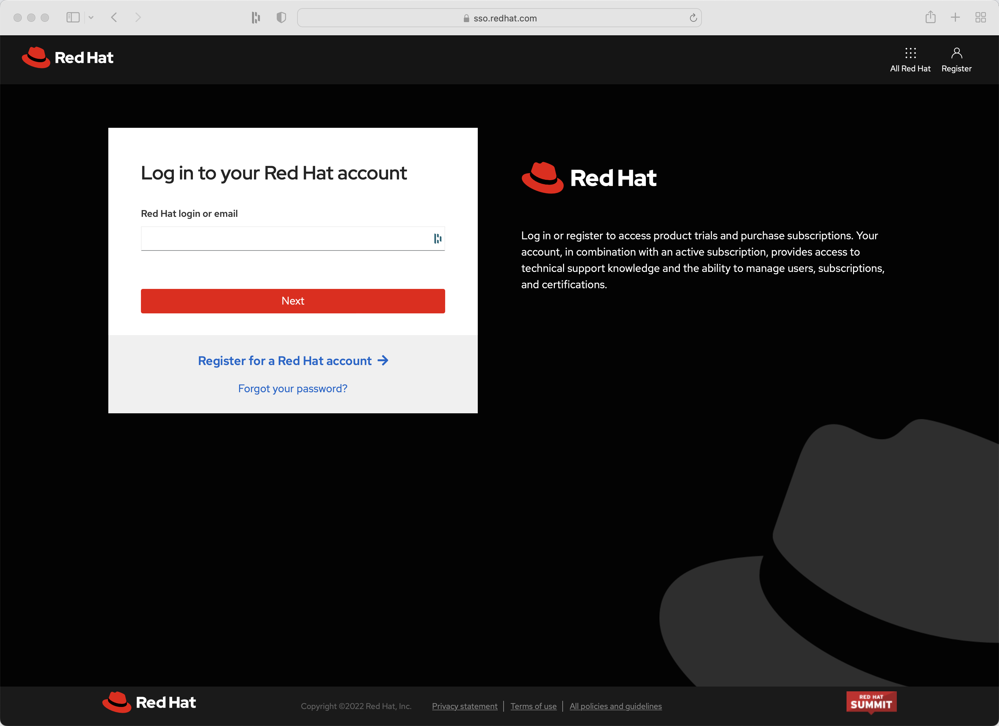

# Quarkus


## Java Setup
https://sdkman.io/

```
sdk install java 17.0.2-open
sdk use java 17.0.2-open
```


```
java -version 
openjdk version "17.0.2" 2022-01-18
```

```
sdk install maven 3.8.5
sdk use maven 3.8.5
```

```
mvn -v
Apache Maven 3.8.5 (3599d3414f046de2324203b78ddcf9b5e4388aa0)
```

https://code.visualstudio.com/

Community Edition of IntelliJ IDEA

https://www.jetbrains.com/idea/download/#section=mac


## New Quarkus Project

https://code.quarkus.io/

RESTEasy Reactive

RESTEasy Reactive Jackson

Hibernate ORM with Panache

SmallRye OpenAPI

SmallRye Health

Micrometer Metrics

Micrometer Registry Prometheus

JDBC Driver - PostgresSQL


```
mkdir ~/projects/todo-projects

cd ~/projects/todo-projects

mv ~/Downloads/qtodo.zip .

unzip qtodo.zip

cd qtodo

tree qtodo

.
├── README.md
├── mvnw
├── mvnw.cmd
├── pom.xml
└── src
    ├── main
    │   ├── docker
    │   │   ├── Dockerfile.jvm
    │   │   ├── Dockerfile.legacy-jar
    │   │   ├── Dockerfile.native
    │   │   └── Dockerfile.native-micro
    │   ├── java
    │   │   └── com
    │   │       └── burrsutter
    │   │           ├── GreetingResource.java
    │   │           └── MyLivenessCheck.java
    │   └── resources
    │       ├── META-INF
    │       │   └── resources
    │       │       └── index.html
    │       └── application.properties
    └── test
        └── java
            └── com
                └── burrsutter
                    ├── GreetingResourceIT.java
                    └── GreetingResourceTest.java

```

```
code .
```


```
mvn quarkus:dev
```


```
curl localhost:8080/hello
Hello from RESTEasy Reactive
```


Back to VS Code


New File

```
Todo.java
```


```
@Entity

extends PanacheEntity
```

Shift-Option-O (Organize Imports)


New File

```
TodoResource.java
```

```
@Path("/api")
@Produces("application/json")
@Consumes("application/json")
```

Shift-Option-O (Organize Imports)

```
    @GET
    public List<Todo> getAll() {
        return Todo.listAll();
    }
```

Shift-Option-O (Organize Imports)

Ctrl-S  (Save)

```
curl http://localhost:8080/api
[]
```

```
    @POST
    @Transactional
    public Response create(Todo item) {
        item.id = null;
        item.persist();
        return Response.status(Status.CREATED).entity(item).build();
    }
```

Shift-Option-O (Organize Imports)

Ctrl-S  (Save)


```
curl -X 'POST' \
  'localhost:8080/api' \
  -H 'accept: */*' \
  -H 'Content-Type: application/json' \
  -d '{
  "id": 0,
  "title": "Do a thing",
  "completed": false
}'
```

```
curl http://localhost:8080/api
[{"id":1,"title":"Do a thing","completed":false,"order":0,"url":null}]
```

Drag & Drop frontend js, node_modules, package.json, package-lock.json, package.json, todo.html

to src/resources/META-INF/resources


Browser: http://localhost:8080/todo.html

Enter "Do another thing"


```
    @PATCH
    @Path("/{id}")
    @Transactional
    public Response update(Todo todo, @PathParam("id") Long id) {
        Todo entity = Todo.findById(id);
        entity.id = id;
        entity.completed = todo.completed;
        entity.order = todo.order;
        entity.title = todo.title;
        entity.url = todo.url;
        return Response.ok(entity).build();
```    

Refresh Browser: http://localhost:8080/todo.html

Add Fred, Sally, John and UPDATED! on Sally


```
    @DELETE
    @Transactional
    @Path("/{id}")
    public Response deleteOne(@PathParam("id") Long id) {
        Todo entity = Todo.findById(id);
        if (entity == null) {
            throw new WebApplicationException("Todo with id of " + id + " does not exist.", Status.NOT_FOUND);
        }
        entity.delete();
        return Response.noContent().build();
    }
```

Ctrl-S

Refresh Browser: http://localhost:8080/todo.html

Add Apple, Banana, Grapefruit


And then hit the red X beside Banana

Refresh Browser: http://localhost:8080/todo.html


Browser: http://localhost:8080/q/swagger-ui/


Up to this moment, "mvn quarkus:dev" has been using its Dev Services capability to dynamically provide a Postgres Database.  

http://localhost:8080/q/dev/io.quarkus.quarkus-vertx-http/dev-services


This magic was faciltated by the inclusion of the Postgress JDBC Driver, TestContainers and Docker Desktop.

```
docker ps
```


To get ready for testing within Kubernetes/OpenShift, we need to provide the declarative properties and connection parameters.


Edit application.properties

Type "q.h.d.g" and hit return


Type "update" and hit return

Type "q.d.j.u" and hit return

Type "jdbc:postgresql://postgresql/todo" and hit return

Type "q.d.us" and hit return

Type "todo" and hit return

Type "q.d.p" and hit return

Type "todo" and hit return

Type "q.p.ty" and hit return

Type "uber-jar" and hit return

Cntrl-S


Add a prefix of `%prod` so that things work more cleanly between your localhost dev mode and your test/production cluster.


Here is the full listing if you just wish to copy & paste

```
%prod.quarkus.hibernate-orm.database.generation=update
%prod.quarkus.datasource.jdbc.url=jdbc:postgresql://postgresql/todo
%prod.quarkus.datasource.username=todo
%prod.quarkus.datasource.password=todo
quarkus.package.type=uber-jar
```


Make sure to "Ctrl-C" the `mvn quarkus:dev` and shut it down

```
mvn package
```


```
ls -la target
total 72064
drwxr-xr-x  13 burr  staff       416 Apr 23 15:29 .
drwxr-xr-x@ 12 burr  staff       384 Apr 23 13:33 ..
drwxr-xr-x   5 burr  staff       160 Apr 23 13:37 classes
drwxr-xr-x   3 burr  staff        96 Apr 23 13:33 generated-sources
drwxr-xr-x   3 burr  staff        96 Apr 23 13:33 generated-test-sources
drwxr-xr-x   3 burr  staff        96 Apr 23 15:23 maven-archiver
drwxr-xr-x   3 burr  staff        96 Apr 23 13:33 maven-status
-rw-r--r--   1 burr  staff  35653430 Apr 23 15:29 qtodo-1.0.0-SNAPSHOT-runner.jar
-rw-r--r--   1 burr  staff   1232955 Apr 23 15:29 qtodo-1.0.0-SNAPSHOT.jar.original
drwxr-xr-x   3 burr  staff        96 Apr 23 13:37 quarkus
-rw-r--r--   1 burr  staff       121 Apr 23 15:29 quarkus-artifact.properties
drwxr-xr-x   4 burr  staff       128 Apr 23 15:22 surefire-reports
drwxr-xr-x   4 burr  staff       128 Apr 23 15:29 test-classes
```

The `qtodo-1.0.0-SNAPSHOT-runner.jar` is the one you want for Drag & Drop


### Deploy via OpenShift Drag & Drop

For an easy way to get an OpenShift, go to https://developers.redhat.com/developer-sandbox/get-started

[OpenShift Sandbox](https://developers.redhat.com/developer-sandbox/get-started)

Account creation and login skipped for the purposes of this tutorial





Hit the Create button


You should get a red ring because the app needs a database

Add 


Answer some questions

- PostgreSQL Connection Username: todo

- PostgreSQL Connection Password: todo

- PostgreSQL Database Name: todo

and click **Create**


Looking for blue rings


Find the URL,


Add some Todos 


Now, let's go see if our data really landed in the database, back in the OpenShift Console, Click on DC postgresql


Click on pod identifier/name


Click on Terminal and type `psql`


See the databases

```
\l
```

See the users

```
\du
```


Connect to the todo database

```
\c todo
```

See the tables

```
\dt
```


See the todos

```
select * from todos;
```

Note: That trailing semi-colon is VERY important


Describe the schema

```
\d todo
```

```
                         Table "public.todo"
  Column   |          Type          | Collation | Nullable | Default
-----------+------------------------+-----------+----------+---------
 id        | bigint                 |           | not null |
 completed | boolean                |           | not null |
 ordering  | integer                |           |          |
 title     | character varying(255) |           |          |
 url       | character varying(255) |           |          |
```

### Deploy via OpenShift S2I

Assuming you followed the above instructions, just delete the current qtodo application


Create a git repo and `git commit` and `git push` the contents of qtodo (or just use the one I am providing)

Click +Add


Import from Git


Git Repo URL

https://github.com/burrsutter/todo-apps

And because I am using a sub-directory inside of a git repository, I need to click

*Show advanced Git options*

and type in `qtodo` there


Scroll-down, defaults should be fine


Click Create

The application will build and run, giving you a URL and you should see the Todos from your Drag & Drop deployment and testing still happily running in that same Postgres database as before.


And you can create a webhook if you want future `git push` events to trigger a build and rollout of the application into your dev cluster

[Webhooks on OpenShift](https://redhat-scholars.github.io/openshift-starter-guides/rhs-openshift-starter-guides/4.9/nationalparks-java-codechanges-github.html#prerequisite_github_account)


### Deploy via Kubernetes yamls

Assuming you followed the above instructions, just delete the current qtodo application


Use `shift-command-p` on your keyboard


Hit Return


Type "Kube"


Click it


Hit Return

The new dependency gets added to your pom.xml


Open up target to see what is in there


At the terminal, type `mvn package`

and if it fails like the following:

```
[ERROR] Failed to execute goal io.quarkus.platform:quarkus-maven-plugin:2.8.1.Final:build (default) on project qtodo: Failed to build quarkus application: io.quarkus.builder.BuildException: Build failure: Build failed due to errors
[ERROR] 	[error]: Build step io.quarkus.kubernetes.client.deployment.KubernetesClientBuildStep#process threw an exception: io.fabric8.kubernetes.client.KubernetesClientException: JcaPEMKeyConverter is provided by BouncyCastle, an optional dependency. To use support for EC Keys you must explicitly add this dependency to classpath.
[ERROR] 	at io.fabric8.kubernetes.client.internal.CertUtils.handleECKey(CertUtils.java:164)
[ERROR] 	at io.fabric8.kubernetes.client.internal.CertUtils.loadKey(CertUtils.java:134)
[ERROR] 	at io.fabric8.kubernetes.client.internal.CertUtils.createKeyStore(CertUtils.java:112)
[ERROR] 	at io.fabric8.kubernetes.client.internal.CertUtils.createKeyStore(CertUtils.java:247)
[ERROR] 	at io.fabric8.kubernetes.client.internal.SSLUtils.keyManagers(SSLUtils.java:153)
```

Make sure all of these dependencies are in your pom.xml

```
    <dependency>
      <groupId>io.quarkus</groupId>
      <artifactId>quarkus-kubernetes</artifactId>
    </dependency>
    <dependency>
      <groupId>org.bouncycastle</groupId>
      <artifactId>bcprov-jdk15on</artifactId>
      <version>1.70</version>
    </dependency>
    <dependency>
      <groupId>org.bouncycastle</groupId>
      <artifactId>bcpkix-jdk15on</artifactId>
      <version>1.70</version>
    </dependency>
```

If failed, add the dependencies and try again

At the terminal, type `mvn package`

If all goes well, you now have a kubernetes.yaml file which can be applied to minikube, OpenShift, GKE, etc.  

Note: This does NOT include postgres, getting that service up and running on your Kubernetes cluster will need to be researched and executed manually


