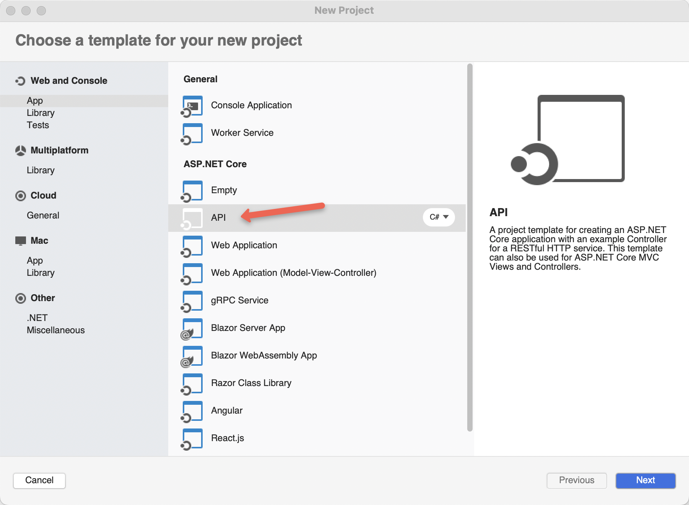

# CRUD RDBMS ToDos

REST API

Create

Read

Update

Delete

Postgres

[TodoMVC](https://todomvc.com/) Frontend UI


## My Java Setup

https://sdkman.io/

```
sdk install java 17.0.2-open
sdk use java 17.0.2-open
```


```
java -version 
openjdk version "17.0.2" 2022-01-18
```

```
sdk install maven 3.8.5
sdk use maven 3.8.5
```

```
mvn -v
Apache Maven 3.8.5 (3599d3414f046de2324203b78ddcf9b5e4388aa0)
```

https://code.visualstudio.com/

Community Edition of IntelliJ IDEA

https://www.jetbrains.com/idea/download/#section=mac


Docker Desktop
https://www.docker.com/products/docker-desktop/

```
docker -v
Docker version 20.10.14, build a224086
```

Clean out docker daemon

```
docker rm `docker ps -a -q`
docker rmi `docker images -a -q`
```

```
brew install kubectl
```

```
kubectl version
Client Version: version.Info{Major:"1", Minor:"23", GitVersion:"v1.23.6", GitCommit:"ad3338546da947756e8a88aa6822e9c11e7eac22", GitTreeState:"clean", BuildDate:"2022-04-14T08:41:58Z", GoVersion:"go1.18.1", Compiler:"gc", Platform:"darwin/arm64"}
```


## Quarkus


[Quarkus](https://github.com/burrsutter/todo-apps/blob/main/quarkus.md)


## Spring Boot


## .NET C#

https://visualstudio.microsoft.com/vs/mac/


https://docs.microsoft.com/en-us/dotnet/core/install/macos




## Node.js 

